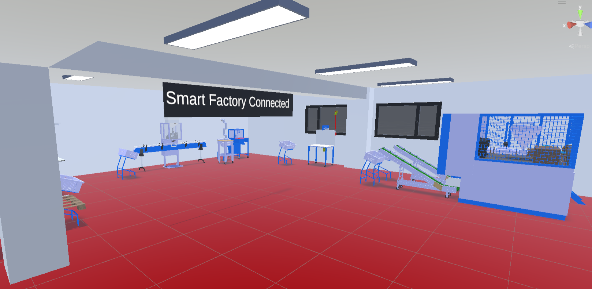
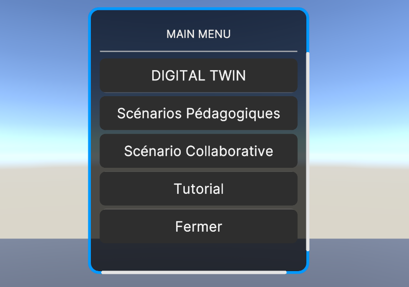
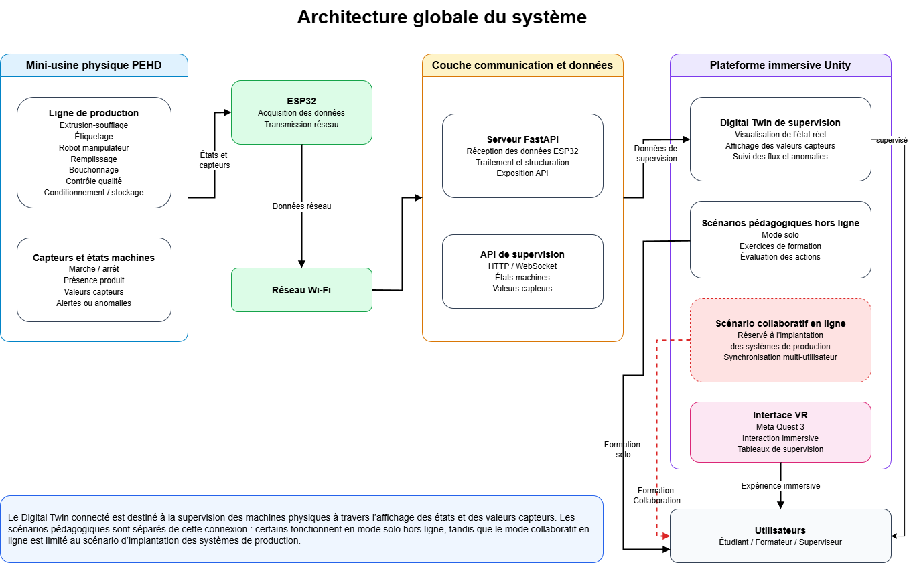
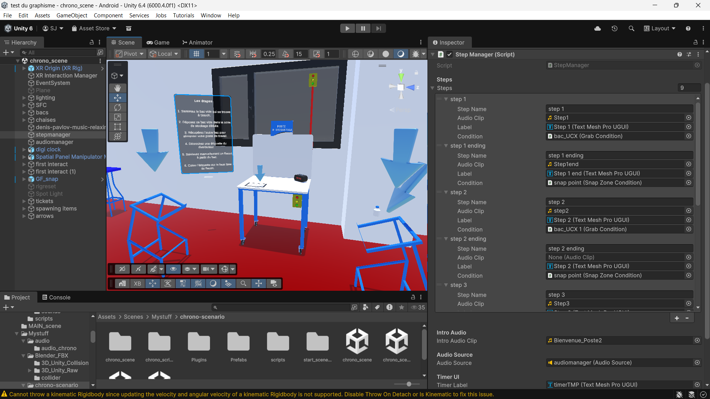

# Digital Twin Immersif d'une Smart Factory

> Développement d'un **Digital Twin immersif** d'une ligne de production de flacons en PEHD destiné à la **formation immersive**, à la **supervision industrielle** et à la **recherche en Industrie 4.0**, réalisé dans le cadre de la plateforme **HESTIM Smart Factory Connected (SFC)**.

---

## 1. Getting Started (How to Run the Project)

Follow these steps to get the project up and running in Unity and start the VR simulation. For a more detailed guide, see [docs/06_Installation.md](docs/06_Installation.md).

### Step 1: Open the Project in Unity
1. Install **Unity 6** with Android/OpenXR build support.
2. Open **Unity Hub**, click **Add**, and select the root folder of this repository (which contains the `Assets`, `Packages`, and `ProjectSettings` folders).
3. Wait for Unity to import the assets and resolve dependencies (this may take a few minutes the first time).
4. In the Project window, navigate to your scenes folder (e.g., `Assets/Scenes/`) and open the main menu scene or `MAIN_scene`.

### Step 2: Run the VR Application
1. Ensure your **Meta Quest 3** is connected to your PC via Quest Link or Air Link.
2. Verify that **OpenXR** is set as the active runtime in your Oculus app and Unity Project Settings.
3. Press the **Play** button in the Unity Editor. You will see the main menu and can navigate to the scenarios:

### Step 3: Start the Backend (Optional for IoT Data)
If you want to test the connected supervision (IoT Pipeline):
1. Navigate to the `FastAPI` directory in your terminal.
2. Install Python dependencies: `pip install -r requirements.txt`
3. Start the server: `uvicorn main:app --host 0.0.0.0 --port 8000`
4. The Unity app will automatically attempt to connect to this server via WebSocket to retrieve machine states.

---

## 2. Project Overview

This repository contains the complete development of an immersive Digital Twin of a PEHD (High-Density Polyethylene) bottle production line, developed within the Smart Factory Connected (SFC) at the H-FAB laboratory of HESTIM. 

The primary goal of this project is to bridge the gap between physical industrial systems and immersive virtual reality by creating a platform that serves both as an **educational training tool** and as a **proof of concept for connected industrial supervision**. 

Unlike a standard 3D simulation, this environment is built to be a true Digital Twin. It incorporates an IoT data pipeline that connects the physical factory to the Unity VR environment in real-time, starting with the extrusion-blow molding machine's temperature.

---

## 3. Project Objectives

The project is driven by the need to safely and effectively train students and operators on complex Industry 4.0 systems, while also addressing the challenges of physical machine availability. The core objectives are:

### General Objective
To develop an immersive Digital Twin of the HESTIM Smart Factory PEHD bottle production line, providing a pedagogical simulation platform and a first proof of concept for VR-based connected supervision.

### Specific Objectives
*   **3D Modeling & Virtual Environment:** Create highly accurate, optimized 3D representations of the industrial equipment (using CATIA V5, FreeCAD, and Blender) and assemble a faithful VR replica of the factory in Unity.
*   **Machine Logic & Animation:** Develop the functional behaviors, physics, and animations for each workstation to reflect the real-world manufacturing flow.
*   **Pedagogical Scenarios:** Implement structured, offline VR training scenarios—specifically a timed labeling task—to evaluate user performance, learning progression, and the effectiveness of progressive VR guidance.
*   **Connected Supervision (IoT Pipeline):** Design and implement a robust communication architecture using ESP32 microcontrollers to capture physical machine data, a FastAPI server to process it, and Unity to visualize it in real-time.
*   **Multiplayer / Collaborative Readiness:** Lay the technical groundwork (using Unity Netcode) for future collaborative scenarios, such as the collaborative planning and layout of production systems.

---

## 4. System Architecture

The architecture relies on a clear separation between the physical layer, the communication middleware, and the immersive virtual layer.

*   **ESP32:** Captures real-time sensor data (e.g., machine temperature).
*   **FastAPI:** Acts as the central hub, receiving data via HTTP POST requests and exposing it to Unity via WebSockets.
*   **Unity (Meta Quest 3):** Renders the Digital Twin, manages the pedagogical scenarios, and visualizes the live IoT data in the VR space.

---

## 5. Educational Scenarios

### Implemented: Timed Labeling Scenario
This scenario is fully operational and used for experimental research on VR learning.
*   **Objective:** Train users on the precise sequence of the manual labeling workstation.
*   **Sessions:** 
    1.  *Guided:* Full audio/visual assistance.
    2.  *Autonomous:* No assistance, relies on memory.
    3.  *Stress Test:* Introduces unexpected events (e.g., missing labels).
*   **Evaluation:** Tracks completion time, accuracy, and manipulation errors to analyze learning progression.

### In Development: Collaborative Factory Layout
*   **Objective:** A multiplayer scenario where several users share the VR space to discuss and rearrange the layout of the factory machines to optimize production flow.
*   **Technology:** Built using Unity Netcode for GameObjects.

---

## 6. Smart Factory Workstations

The HESTIM Smart Factory Connected (SFC) is a miniaturized, automated production line designed for educational and experimental purposes. It reproduces the complete lifecycle of a PEHD bottle.

1.  **Extrusion Blow Molding:** Transformation of plastic granules into bottles.
2.  **Decarottage (Trimming):** Removal of excess plastic from the molded bottles.
3.  **Filling & Capping:** Automated dosing of liquid and manual capping of the bottles.
4.  **Labeling:** Manual application of identifying labels.
5.  **Quality Control:** Visual and documentary inspection of the final product.
6.  **Packaging & Storage:** Boxing, palletizing (using a robotic arm), and final storage.

---

## 7. Current Implementation Status

*   ✔ **3D Modeling:** Complete for all primary machines.
*   ✔ **VR Environment:** Assembled and optimized for Meta Quest 3.
*   ✔ **Machine Logic:** Animations and flow logic integrated.
*   ✔ **Connected Supervision:** End-to-end pipeline validated (ESP32 -> FastAPI -> Unity) for extrusion temperature.
*   ✔ **Pedagogical Scenarios:** Timed Labeling scenario fully functional with data tracking.
*   ❌ **Multiplayer:** In active development for the factory layout scenario.
*   ❌ **Full Synchronization:** Currently limited to temperature; requires further hardware integration for full PLC data mirroring.

---

## 8. Research Work

This Digital Twin serves as the experimental foundation for academic research into immersive industrial training. The data collected from the Timed Labeling scenario (via `UserSessionData.csv` and the NASA-TLX workload index) is currently being analyzed for a research paper: 

> *Progressive Guidance and Autonomous Learning in VR-Based Industrial Training: A System Design and Experimental Protocol for the HESTIM Smart Factory Connected.*

---

## 9. Contributors

*   **Developer/Researcher:** Saad Joual
*   **Academic Supervisor:** M. Mourad Zegrari
*   **Industrial Supervisor:** M. Adonko Carlos Koffi
*   **SFC Manager:** Mme. Sokhna Gueye
*   **Institution:** ENSAM Casablanca & HESTIM Engineering & Business School

---

## 10. License

MIT License