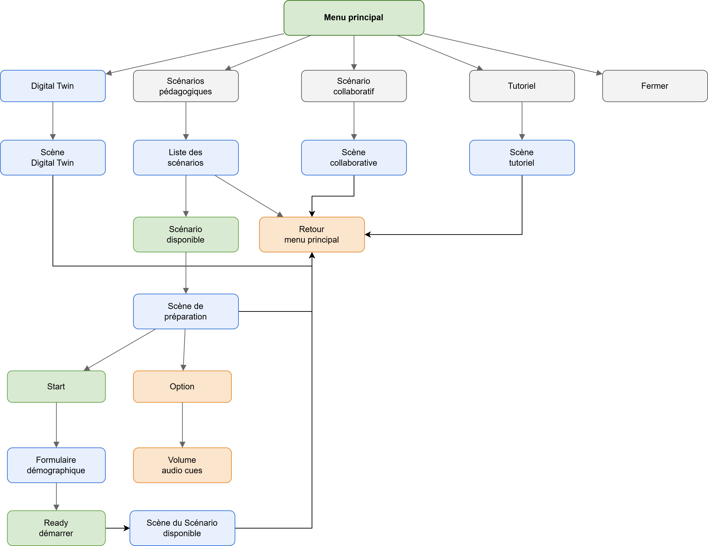
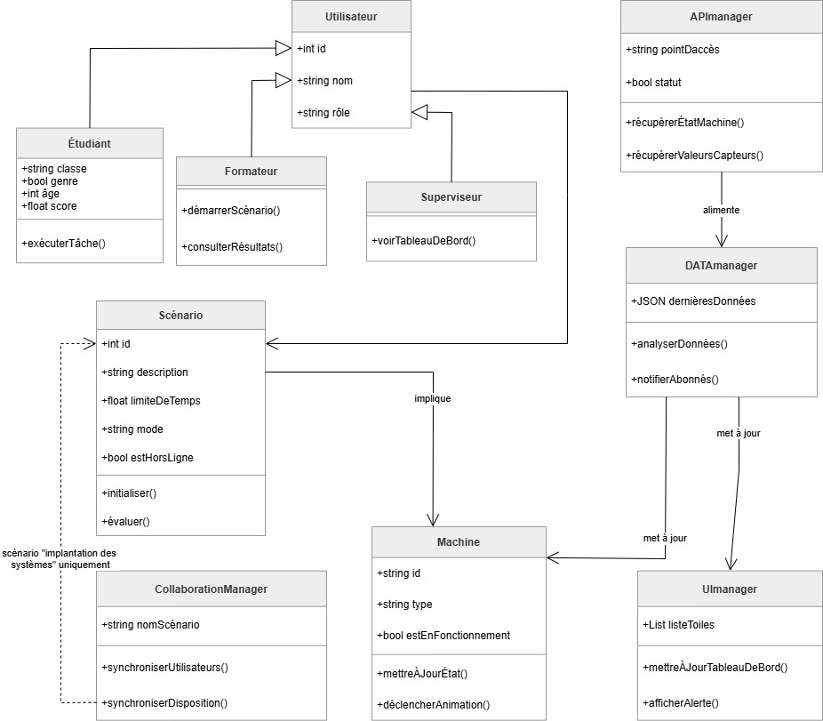
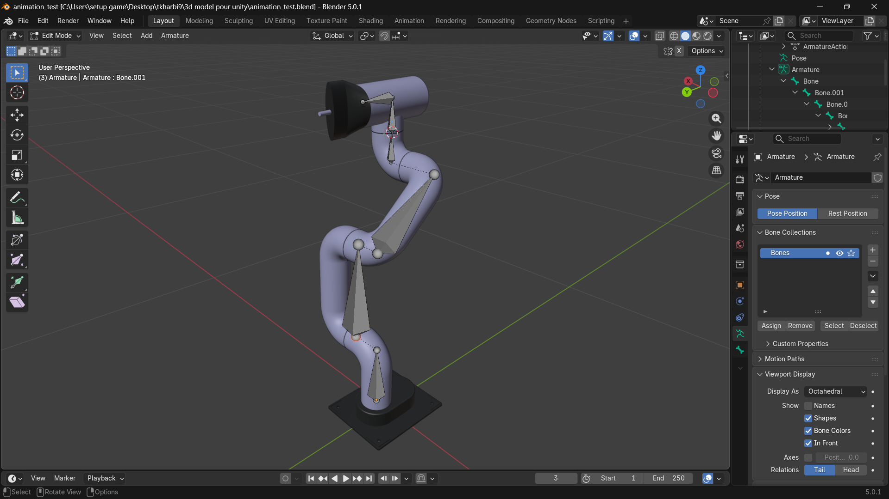

# Unity Architecture & Technical Implementation

This document provides a deep technical dive into how the Unity VR environment is constructed. As an intern, you will spend most of your time here. The project uses **Unity 6** and the **XR Interaction Toolkit (XRI)**.

## 1. Scene Management
To maintain performance and modularity, the project is divided into multiple scenes rather than one massive file:
- **`MAIN_scene`**: The entry point containing the main UI canvas. From here, users select the Digital Twin mode or the pedagogical scenarios.
- **Digital Twin Scene**: Dedicated to the live IoT visualization.
- **Pedagogical Scenarios (e.g., Labeling)**: Contains the specific logic for offline training.

## 2. The XR Rig and Interaction
The project relies on the **OpenXR** standard. 
- We use the `XR Origin` setup to represent the user in the virtual space.
- Controllers use `XR Ray Interactor` for distant UI selection and `XR Direct Interactor` for grabbing objects (flacons, labels).
- **Tip for Interns:** If hand tracking or controllers fail, always check the `XR Interaction Manager` and ensure the OpenXR plugin is active in Project Settings.

## 3. The `StepManager` Logic (Crucial for Scenarios)
The pedagogical scenarios are powered by a generic, reusable script called `StepManager`. Instead of hardcoding every single step in C#, the `StepManager` uses Unity's Inspector to define a sequence of steps.

### How it works:
Only one step is active at a time. The `StepManager` plays the audio cue, highlights the UI text, and activates a specific **Condition**. Once the condition is met, it stops the timer, records any errors, and moves to the next step.

### Condition Types:
To detect if a user performed the right action, we use modular condition scripts:
1.  **`placementCondition`**: Validates if the user placed an object (e.g., a bottle) inside a specific trigger collider zone.
2.  **`snapCondition`**: Used alongside Unity's `XRSocketInteractor` to detect when an object snaps into a precise position.
3.  **`grabCondition`**: Triggers simply when the user successfully grabs a specific object.

## 4. Software Architecture (UML)
The C# codebase is structured using Object-Oriented principles. Here is the class diagram showing how the UI, the Data Manager, and the Step logic interact:

## 5. 3D Models & Animation
Models were designed in CATIA V5 and FreeCAD, but **Blender** is used for the final optimization before importing to Unity (as `.fbx` files).
- **Conveyors & Machines**: Handled via simple Unity Animator controllers triggering states like "Idle", "Processing", and "Done".
- **Robotic Arms**: The robot arm was rigged in Blender with an armature to allow for complex kinematic animations inside Unity.

