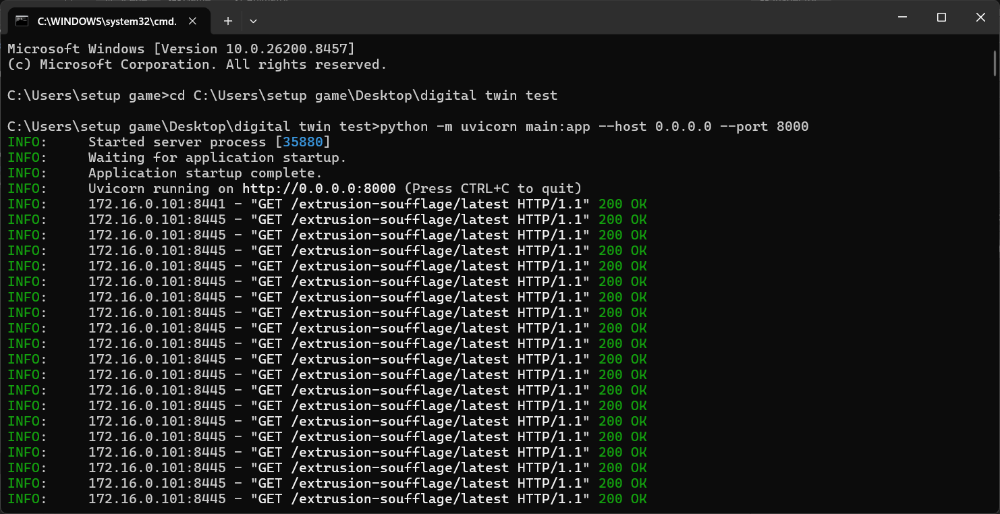
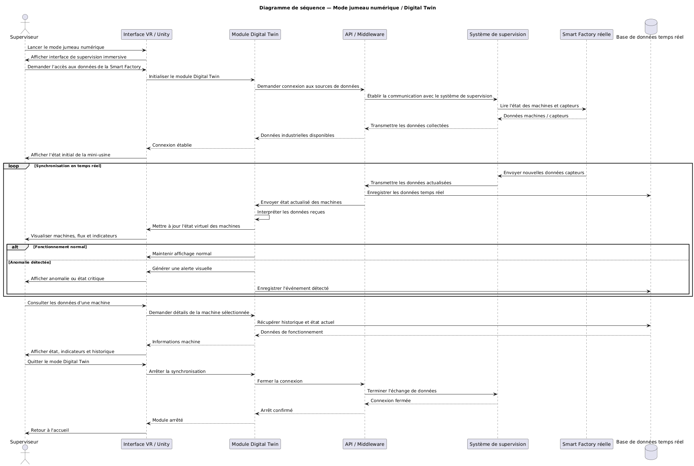

# FastAPI Server (The Middleware)

For future interns, understanding this layer is critical if you want to add new sensors to the Digital Twin. The FastAPI server (written in Python) acts as the bridge between the physical factory (ESP32) and the virtual reality headset (Unity).

## Why FastAPI?
FastAPI is used because it handles asynchronous requests exceptionally well and has built-in support for **WebSockets**, which is mandatory for real-time 3D applications. 

## The Data Flow
1. **Acquisition:** The ESP32 reads physical sensors.
2. **HTTP POST:** The ESP32 sends a JSON payload to a FastAPI HTTP endpoint (e.g., `/api/telemetry`).
3. **State Storage:** FastAPI stores this data in its memory.
4. **WebSocket Broadcast:** FastAPI instantly pushes this new data to any connected Unity client via a continuous WebSocket stream.

## Sequence Diagram
Here is exactly how the communication is orchestrated between the 3 layers:

## How to add a new sensor (Intern Guide)
1. **Update the Python Model:** In your FastAPI `main.py`, find the Pydantic data model (e.g., `class TelemetryData(BaseModel):`) and add your new sensor variable (e.g., `conveyor_speed: float`).
2. **Update the ESP32 Code:** Have the ESP32 include `"conveyor_speed": 1.5` in its JSON payload.
3. **Update Unity C#:** In Unity, find the `WebSocketClient` script, locate where the JSON string is parsed, and map the new `conveyor_speed` variable to the 3D conveyor belt's animator speed.
