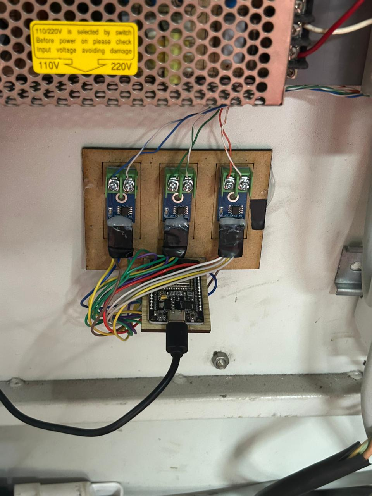

# ESP32 Data Acquisition Layer

The ESP32 is a low-cost, low-power microcontroller with built-in Wi-Fi. It is the "brain" on the physical factory floor that translates electrical signals from the machines into digital data for the network.



## Technical Role
The ESP32 is physically wired to the sensors of the extrusion-blow molding machine (currently measuring temperature). 

### The C++ Firmware
The code running on the ESP32 is written in C++ (typically via the Arduino IDE). The loop generally performs the following:
1.  **Read Analog/Digital Pin:** Reads the voltage from the temperature sensor.
2.  **Conversion:** Converts the raw voltage into a readable Celsius value.
3.  **JSON Formatting:** Packages the data using the `ArduinoJson` library.
    ```json
    {
      "machine_id": "extrusion_01",
      "temperature": 120.5,
      "timestamp": "2026-05-08T13:39:31"
    }
    ```
4.  **HTTP POST:** Connects to the local Wi-Fi and sends this JSON payload to the FastAPI server's IP address.

## Troubleshooting for Interns
- **Wi-Fi Issues:** The ESP32 *must* be on the exact same local network (SSID) as the PC running the FastAPI server. If you change routers or move the setup, you must update the SSID and Password in the C++ code and reflash the board.
- **Server IP:** If the IP address of the PC running the FastAPI server changes (DHCP), the ESP32 will fail to send data. Always ensure the `server_url` in the ESP32 code matches the host PC.
